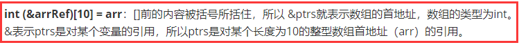
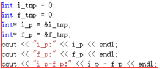
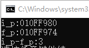

### 3.5.1 定义和初始化内置数组

#### 理解复杂的数组申明

int *ptrs[10]：首地址为ptrs，且长度为十的数组，数组的每个元素都是一个指向int类型的指针。

int (*ptrs)[10]：ptrs指向一个长度为十的整型数组。

int &ptrs[10] = **&arr**：错误，不存在引用数组。

int (&ptrs)[10] = **arr**：ptrs表示对一个长度为十整型数组的引用。

> 总结：

对于一个数组的定义，[]前的内容是否被括号所括住，解释通常具有很大的区别。例如：

**int (*ptrs)[10]**：[]前的内容被括号所括住，所以 *ptrs就表示数组的首地址，数组的类型为int。既然 *ptrs表示数组的首地址，因此ptrs就表示指向数组的指针。

**int *ptrs[10]**：[]前的内容没有被括号所括住，所以ptrs就表示数组的首地址，数组的类型为int*。

同理，

**int (&arrRef)[10] = arr**：[]前的内容被括号所括住，所以 &ptrs就表示数组的首地址，数组的类型为int。&表示ptrs是对某个变量的引用，所以ptrs是对某个长度为10的整型数组首地址（arr）的引用。

**int &refs[10]**：[]前的内容没有被括号所括住，所以ptrs就表示数组的首地址，数组的类型为int&。由于不存在引用类型的数组，所以这个定义是有错误的。

> 为什么不存在引用类型的数组？

数组，使用的是连续的内存空间来存储数据，假如存在某个数组存储的数据的类型是int&，则数组中每个元素都是对分布在内存不同位置的int类型数据的引用，这显然和“数组使用连续的内存空间来存储数据”相互矛盾。总而言之，数据的类型之所以不能是引用类型，是因为不能保证数据所引用的元素位于连续的内存空间中。

那么，假如存在一系列的int类型的数据，位于连续的内存空间中，想被某个引用类型的数组的每个元素依次引用，是否行得通？

答案是肯定的，其实它的本质就是**对数组的引用**。然而对数组的引用不需要依次对数组中每个元素进行引用，只需要对数组的首地址进行引用即可，如上述使用示例：

当然，对复杂的数组声明中，对修饰符的数据并没有限制，例如：

int *(&arrRef) [10] = arr;  // 如上分析，该数组的首地址为&arrRef，数组的类型为int *，又由&符号可知，arrRef是对某个变量的引用。最终可以分析出：arrRef是对某个长度为10的int *类型数组首地址的引用。

### 3.5.3 指针和数组

> 不能将int类型的数据赋值给int*数据；

原因：int*类型的数据是指针，指针是系统内存的地址，系统内存是由操作系统规定的，假如用户强行直接指定内存地址，极有可能导致无法修复的损害。

> 不能将int*类型的数据赋值给int数据。

原因：将内存地址赋值给整型数据，没有原则上的错误。之所以不能将int*数据赋值给int数据，主要是因为两种数据的数据类型不一致，int *本质上是十六进制的数据，只需要对int *数据进行强制类型转化，即可将其赋值给int类型数据。

**注意**：其实，经过强制类型转换，int类型的数据和int *类型的数据时可以互相赋值的，例如：

> int value = 42;
>
> int *p = (int *) value;
>
> cout<<p<<endl;    // 输出结果为：2A，是42的十六进行形式。
>
> 注意：如上操作极有可能给p赋值了一个违法的地址，所以使用p去操作内存地址极有可能导致无法挽回的损失。
>
>
>
> int value1 = 888;  // 并且假设value1的内存地址为：0000002A
>
> int value = (int)(&value1);
>
> cout<<value<<endl;    // 输出结果为：42，是2A的十进制形式。   

#### 指针相加减and迭代器相加减

> 首先，指针之间是不能相加的；迭代器之间也是不能相加的。

原因：相同类型的指针相加其实没有什么原则上错误，因此两个地址无非就是两个十六进制的数，是完全可以相加的。但是由于指针相减结果可以表示两指针相隔的元素个数，指针相加却没有什么特殊含义。所以编译器通常没有定义两个指针的相加运算，准确来说是编译器不允许出现两个指针相加这种操作的。

同理，两个迭代器相减可以表示两个迭代器相隔元素的个数，但两个迭代器相加没有什么特殊含义。同样也是编译器没有定义两个迭代器相加的操作。

> 指针相减：（前提：指针是同一类型）

1.它们指向同一数组：相减结果表示两个指针相隔的元素个数。

2.没有指向同一数组：可以相减，但是相减的结果没有意义。

例如：

虽然两个整型变量没有位于同一个数组中，但是它们的地址仍然可以相减。相减的结果仅仅是两个指针值的相减结果除以所指对象的大小 。转化为十进制，相减，除以数据大小： {(8 *16+0)-(7 *16+4)}/4=3

> 迭代器相减（前提：两迭代器指向同一个对象）

相减的结果同样表示两个迭代器相隔的元素个数，作用和指针相减类似。

> 注意：不同类型的指针是不能够相减的；指向不同对象的迭代器也是不能相减的。

指针类型相同时，两指针相减可以表示两指针相隔对象的个数。指针类型不同时，两指针所指向的对象所占空间通常不一致，所以即使知道两个指针值的差，仍然无法计算两指针相隔对象的个数。因为这个原因，即使是两个不同类型的指针所指对象具有占用相同大小的内存空间，编译器仍然不允许两指针相减。

目前对于迭代器的本质没有很好的认识（尝试将迭代器通过cout输出，结果报错），所以目前尚不能解释为什么指向不同对象的迭代器不能够相减。   

> 总结：相同类型的指针可以相减；指向同一对象的迭代器可以相减。其它类型的操作都是非法的。

