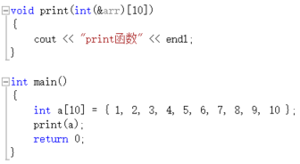

**引用类型的形参**：是其对应的实参的别名。

**指针形参**：和普通“传值参数”类似，指针的值被拷贝给形参。拷贝之后，实参指针和形参指针不是同一个指针，但是它们指向同一个对象。局部函数可以修改实参指针所指对象的值，但是却无法修改实参本身。

> 使用引用避免拷贝

当某些对象特别大时，直接拷贝给形参是十分低效的操作。特别是当函数中不会修改实参的值时，直接使用引用作为实参是最好的选择。另外，为了确保函数内部确实不会修改对象的值，可以将引用形参定义为const类型。另外，还可以利用引用形参使得一个函数返回额外的信息（即，可以在函数内部修改引用形参，作为额外信息）。

**注意**：为const类型的引用形参传入非const类型的实参是合法的，编译器不会通过引用形参修改实参的值。

> 备注

1.void fun(const int i)和void fun(int i)被认为是重复定义，虽然两个函数形参形式上有区别，但在比较两个函数定义是否重复时，顶层的const会被忽略掉。

**解释**：对于函数void fun(const int i)既可以传入const实参，也可以传入非const实参。因此，当向fun中传入一个非const实参时，编译器无法判断应该调用哪一个函数。所以认为这两个函数属于重复定义。

**注意**：仅仅是顶层const会被忽略；底层const仍然会被保留。例如：void fun(const int * i)和void fun(int * i)，不认为是重复的函数定义。**原因还不太明白？？？？？**

经过实验，int *类型的实参同样可以传递给const int *  类型的形参。使用int *i形参时，编译器对于void fun(int * i)函数的调用优先级高于void fun(const int * i)函数。

### 6.2.4 数组形参

普通数组做形参，主要包含如下三种形式（三种形式完全等价）：

void print(int* name)

void print(int[] name)

void print(int[10] name)  // 注意，这里的维度表示我们期望数组包含多少元素，实际上不一定，此处可以给维度赋值为任意值。

> 注意：

但是有一个和数组做形参十分相似的例子，该例子存在一些不同的情况。即，当数组的引用做形参时，形参必须要指定数组的维度，并且实参数组的维度必须和形参中指定的维度相同。使用方式如下图所示：

为什么会有这种区别呢？

答：原因类似于数组引用的定义，详情请参见3.5.1。数组做形参，传进去的只是数组的首地址，数组后面可能包含的维度仅仅是我们期望数组包含多少元素，但是在函数体中不会使用该维度值，所以只要对数组的读写操作不超过数组的真实长度都是合法的。数组引用做形参，形参数组是实参数组的别名。

> 二维数组做形参：

void print(int (*matrix)[10])

void print(int matrix\[\]\[10\])

上面两种定义的方式是完全等价的。虽然下面的那种定义中matrix看起来是二维数组，但是两种定义本质上形参都是指向10个整型数组的指针。

	原书中提到“编译器会一如既往地忽略掉第一个维度”，之所以会忽略掉第一个维度，是因为不管matrix在形式上是一维、二维或者n维数组，其在内存中的分布都是一维的，并且在数组的定义时，数组所包含的元素总个数就会被确定下来。所以当二维数组做形参时，只要指明了第二个维度，编译器会结合数组元素总个数，自动计算出第一个维度，所以编译器会自动忽略掉第一个维度的值。

> 由二维数组做形参引发的思考，二维数组名作为指针的指针该如何理解？

	形如：int test[][5] = { { 1, 2, 3, 4, 5 }, 
	
					      { 6, 7, 8, 9, 10 } };

这样的二维数组，虽然形式上是二维数组，但是在内存中却是以一维的方式存储的（分为行优先和列优先两种方式，经过测试vs2013对于二维数组的存储采用了行优先的方式）。

由于test的类型是int**，也就是指向数组的指针，实质上test+i就是指向二维数组中某一行一维数组的指针。并且假如test+i指向二维数组的第i行，则test+(i+1)就指向二维数组的第i+1行。这个就类似于int\*指针的移动，假如p是指向int型数组中某个数据的指针，则p+1就会指向下一个整型数据。

**综上而言**：指针的移动和其类型是密切相关的。另外，补充一下，指向数组的指针，实质上是指向数组的首地址。例如test+0，test+1分别指向第一行一维数组的首地址和第二行一维数组的首地址。而\*(test+0)和\*(test+1)分别表示第一行一维数组的首地址和第二行一维数组的首地址。另外，\*(test+0)和\*(test+1)分别和test\[0\]和test\[1]等价。